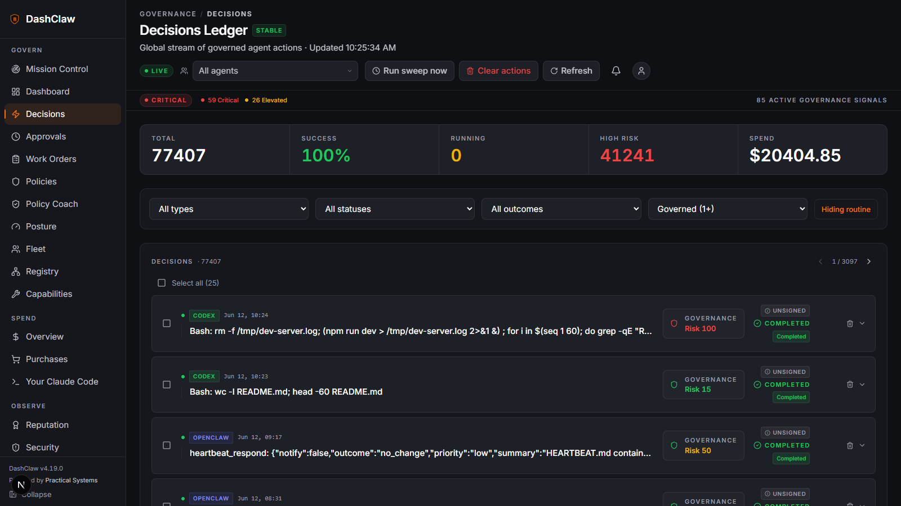
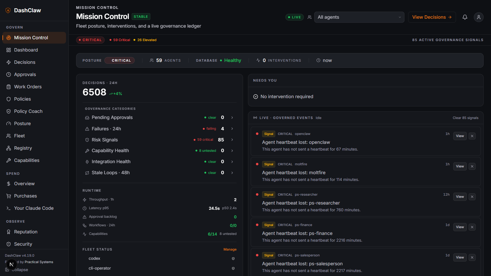
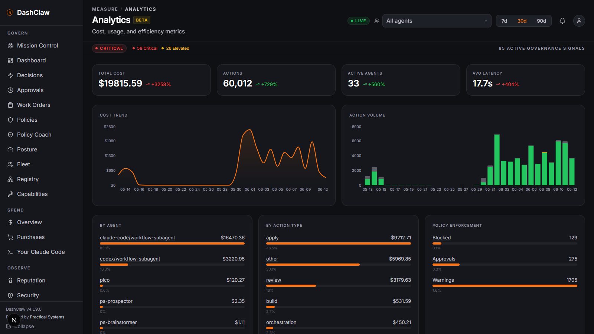
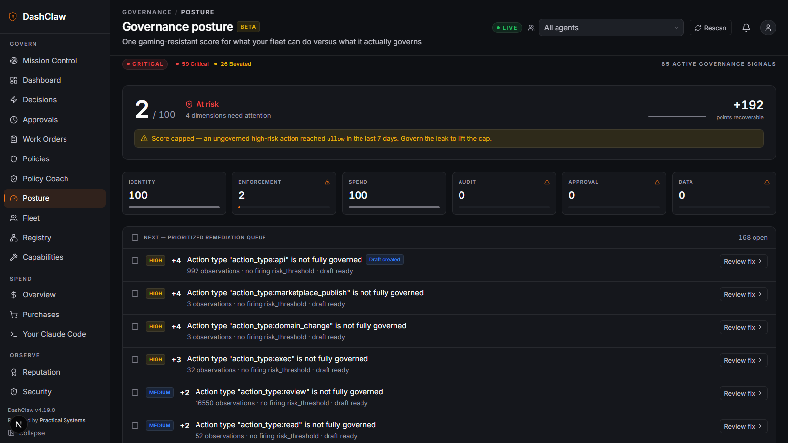
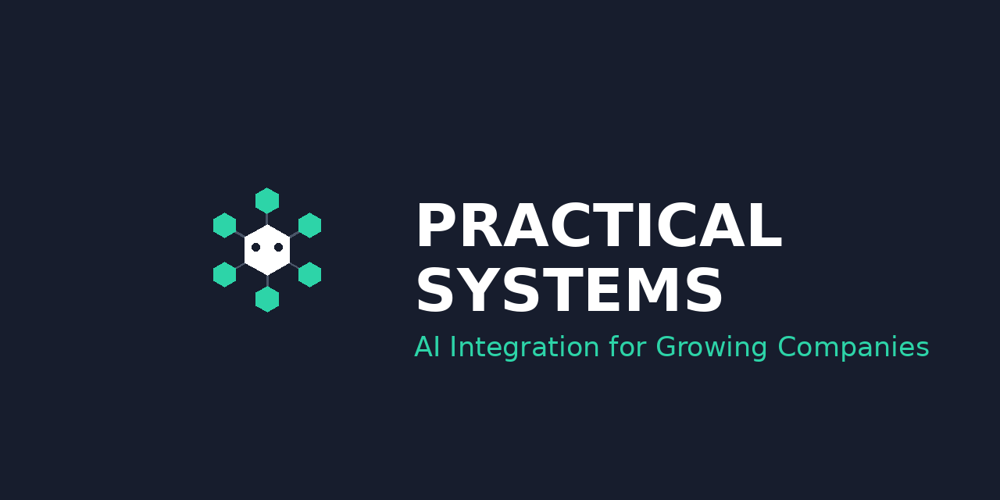

<div align="center">
  

  <h1>DashClaw</h1>

  <p><strong>Govern AI agents before they act.</strong></p>

  <p>
    DashClaw is the governance layer for AI agents that touch real systems.
    It sits between agents and the world, evaluates policy on every risky action,
    routes human approval where it is required, records verifiable evidence,
    and tracks terminal outcomes so a retried agent never silently double-executes.
  </p>

  <p><sub>Plugs into the agents you already run: Claude Code, Codex, Hermes Agent, OpenClaw, Claude Desktop, and Claude Managed Agents. Framework integrations for LangChain, CrewAI, AutoGen, LangGraph, and OpenAI Agents SDK. Any other runtime over MCP, the Node/Python SDK, or direct REST.</sub></p>

  <p>
    <strong><a href="https://hosted.dashclaw.io/connect">Try it now →</a></strong> mint a free trial workspace in your browser and send your first governed action. No install, no deploy.
  </p>

  <p><sub><strong>This project is maintained by an AI</strong> — in public, under a human-held charter. <a href="MAINTAINER.md">MAINTAINER.md</a> holds the five invariants the maintainer cannot change; every decision is on the record in the <a href="docs/maintainer-log.md">maintainer log</a>.</sub></p>

  <p>
    <a href="#deploy"></a>
    <a href="#10-second-demo"></a>
    <a href="#choose-your-integration-path"></a>
  </p>

  <p>
    <a href="https://dashclaw.io"></a>
    <a href="https://dashclaw.io/docs"></a>
    <a href="https://github.com/ucsandman/DashClaw/stargazers"></a>
    <a href="https://github.com/ucsandman/DashClaw/blob/main/LICENSE"></a>
    <a href="https://www.npmjs.com/package/dashclaw"></a>
    <a href="https://pypi.org/project/dashclaw/"></a>
  </p>

  <br />

  

  <p><sub>The loop, end to end: <strong>intent → guard → approve → record</strong>. Rendered with <a href="https://github.com/remotion-dev/remotion">Remotion</a> from <a href="media/remotion/">media/remotion/</a>.</sub></p>
</div>

<br />

## 60-second proof path

1. Read the loop: DashClaw intercepts risky agent intent, enforces policy, records the decision, routes approval when required, and verifies the final outcome. Where the *block* is mechanical vs honored by the agent depends on the surface — hooks and server-executed capabilities halt the action itself; SDK/MCP/chat callers honor the decision. The per-surface table is [`docs/architecture/enforcement-boundary.md`](./docs/architecture/enforcement-boundary.md).
2. Try it hosted, no install: open [hosted.dashclaw.io/connect](https://hosted.dashclaw.io/connect), mint a trial workspace, and send your first governed action straight from the browser. Expected proof: the action lands in your decisions ledger, replayable.
3. Or run the local demo: `npx dashclaw-demo` (needs Docker running). Expected proof: a simulated high-risk deployment is blocked and opens Decision Replay.
4. Self-host the runtime from the deploy guide, then run `npm run doctor` locally or `dashclaw doctor` against the hosted URL. Expected proof: the doctor command exits 0 or names the blocking setup item.
5. Connect one agent with `DASHCLAW_BASE_URL` and `DASHCLAW_API_KEY`. Expected proof: one action appears in `/decisions`, any held action appears in `/approvals`, and `/api/setup/live-proof` can capture setup evidence for onboarding or CI.

## What DashClaw does

| | |
|---|---|
| **Intercept** | Risky agent actions are evaluated before they execute. Block, warn, or hold for approval, by policy — halted mechanically on hook/gateway surfaces (Claude Code, Codex, Hermes, OpenClaw) and for capabilities DashClaw executes; honored cooperatively by SDK/MCP/chat callers ([enforcement boundary](./docs/architecture/enforcement-boundary.md)). |
| **Verify identity** | Agents authenticate with JWKS-verified OIDC bearer tokens (EdDSA / RSA / ECDSA). Replay protection rejects reused tokens; optional action binding scopes a token to one intended call. Cryptographic attribution, not self-assertion. |
| **Enforce** | Declarative policies (risk thresholds, deploy gates, capability access rules, semantic checks) evaluate every reported action; a `block` decision is never downgraded. |
| **Approve** | Pending approvals route to a dashboard queue, the CLI inbox, a mobile PWA, Telegram, or Discord, with one-tap allow or deny. |
| **Record** | Every action becomes a replayable decision record: declared goal, reasoning, risk score, matched policies, assumptions, evidence. |
| **Finalize** | Terminal outcomes are one-shot and durable. Lost confirmations are swept and surfaced, so retries do not double-execute. |
| **Govern external systems** | The capability registry wraps real HTTP APIs with per-agent access rules, rate limits, and audit. |
| **Improve** | Code Sessions ingests Claude Code transcripts (Stop-hook live or JSONL backfill), prices the spend, surfaces optimizer signals (stuck loops, cache crater, context gaps), and distills sessions into an Optimal Files bundle — root CLAUDE.md, path-scoped rules, hooks, and skill packs — applied locally via `dashclaw code apply`. |

---

## The control plane, running

Real screenshots from the maintainer's own live instance — the fleet that builds DashClaw, governed by DashClaw. Dark instrument panel, orange only where attention is required.

**The decisions ledger.** Every governed action lands here with its risk score, matched policies, signature state, and terminal outcome. 77,000+ decisions on this dogfood instance; each one replayable.



**Mission Control.** Fleet posture, the intervention queue, and a live ledger of governed events on one calm screen. Repeated signal occurrences collapse into one row; dismissing it clears them all.



**Spend and posture, measured.** Analytics prices every action and breaks enforcement down by agent and type. Governance posture is one gaming-resistant score: a policy only counts when replaying real traffic proves it fires, and drafting a policy never raises the number.

<table>
  <tr>
    <td width="50%"></td>
    <td width="50%"></td>
  </tr>
  <tr>
    <td align="center"><sub><code>/analytics</code> · cost, volume, enforcement</sub></td>
    <td align="center"><sub><code>/posture</code> · proven coverage, not vibes</sub></td>
  </tr>
</table>

---

## Choose your integration path

DashClaw meets agents where they already are. Every path lands on the same governance primitives, audit ledger, and approval queue — pick the one closest to how your agent already runs.

### Coverage at a glance

| If your agent is… | Use this path | Install |
|---|---|---|
| Claude Code | Plugin + hooks | `npm i -g @dashclaw/cli && dashclaw install claude` |
| Codex | Plugin | `dashclaw install codex --project <path>` |
| Hermes Agent | Plugin (8 lifecycle hooks) | `bash scripts/install-hermes-plugin.sh` |
| OpenClaw | OpenClaw plugin | `npm install @dashclaw/openclaw-plugin` |
| Claude Desktop (chat, web, Cowork) | Custom connector (OAuth, no install) | Settings → Connectors → paste `https://<instance>/api/mcp` |
| Any stdio MCP host | MCP server (stdio) | `npx @dashclaw/mcp-server` |
| Claude Managed Agents | MCP server (Streamable HTTP) | Point at `/api/mcp` |
| LangChain | Python SDK callback handler | `pip install dashclaw` |
| CrewAI | Python SDK task callback / agent wrapper | `pip install dashclaw` |
| AutoGen | Python SDK instrumentation | `pip install dashclaw` |
| LangGraph, OpenAI Agents SDK | Node or Python SDK | `npm install dashclaw` |
| Custom / framework-less | Node or Python SDK | `npm install dashclaw` |
| Anything HTTP | REST API + webhooks | [OpenAPI spec](./docs/openapi/critical-stable.openapi.json) |

Working end-to-end examples for each runtime live in [`examples/`](./examples/) — `anthropic-governed-agent`, `autogen-governed`, `claude-code-review-agent`, `codex-review-agent`, `crewai-governed`, `langgraph-governed`, `managed-agent-governed`, `managed-agent-mcp`, `openai-agents-governed`, and more.

### 1. Coding-agent plugins (Claude Code, Codex, Hermes Agent)

One plugin source, three ecosystems. Distributed via [`plugins/dashclaw/`](./plugins/dashclaw/). Each manifest ships the MCP server config, the `dashclaw-governance` protocol skill, the `dashclaw-platform-intelligence` reference skill, and a distinct `agent_id` so Mission Control separates sessions per host.

```bash
# Claude Code — no clone needed: the CLI downloads the hooks bundle from your
# instance, wires ~/.claude/settings.json, and defaults to observe mode
npm i -g @dashclaw/cli
dashclaw install claude            # prompts for endpoint + API key
dashclaw install claude --trial    # browser signup on hosted.dashclaw.io (default), paste the key

# Codex — installer wires manifest, hooks, and AGENTS.md governance protocol
node cli/bin/dashclaw.js install codex --project /path/to/your/project

# Hermes Agent — 8 lifecycle hooks (pre/post tool, pre/post LLM, on-session
# start/end, secret redaction, subagent_stop ROI tracking)
bash scripts/install-hermes-plugin.sh        # macOS / Linux
powershell -File scripts/install-hermes-plugin.ps1   # Windows
```

For Claude Code specifically, `dashclaw install claude` governs Bash, Edit, Write, MultiEdit, sub-agent spawns, and every `mcp__*` tool call with semantic classification, risk scoring, and per-turn token capture — no SDK calls in your agent code, no repo clone. Identity is per-harness (the installer writes an explicit `--agent-id` onto each hook command, so Claude Code, Codex, and Hermes on one machine report as three distinct agents), and sub-agents appear as their own fleet identities (`claude-code:explore`) grouped under their parent in `/agents`, inheriting its permissions, targeted policies, and spend budgets. It starts in observe mode (decisions logged, nothing blocked); flip to enforce by setting `DASHCLAW_HOOK_MODE=enforce` in `~/.dashclaw/claude-hooks/.env`. Working from a checkout instead, `npm run hooks:install` does the same wiring. Full details in [`hooks/README.md`](hooks/README.md).

**Verify it fires:** pipe a fake tool call through the hook — a clean exit (and a guard evaluation when DashClaw is reachable) confirms the wiring. Use `python3` if your system has no `python` on PATH; the installer picks the right one automatically.

```bash
echo '{"tool_name":"Bash","tool_input":{"command":"echo hello"},"tool_use_id":"test_001","session_id":"smoke"}' | python .claude/hooks/dashclaw_pretool.py
```

### 2. MCP server (zero code, any MCP host)

[`@dashclaw/mcp-server`](./mcp-server) exposes **29 governance MCP tools** across 11 groups — core governance, optimal files, session continuity, credential hygiene, skill safety, open loops, learning + retrospection, agent inbox, agent identity, behavior learning, governance posture — plus 6 read-only resources (`dashclaw://policies`, `dashclaw://capabilities`, `dashclaw://agent/{agent_id}/history`, `dashclaw://status`, `dashclaw://code-sessions/projects`, `dashclaw://code-sessions/sessions/{session_id}`).

As of v2.0.0 the local stdio server also carries **governed execution**: provider tools for GitHub, Vercel, Neon, Stripe and ten more (each registering only when its credential env var is present), and stateful **launch plans** (`create_launch_plan` / `get_launch_status` / `preflight_launch` / `verify_launch`) that track the launch tail with reality-checked, never self-reported completion — every step through the same guard/policy/approval path. See [`mcp-server/README.md`](./mcp-server/README.md) and [`mcp-server/docs/launch-plans.md`](./mcp-server/docs/launch-plans.md).

**Stdio (Claude Code, any stdio MCP client — not Claude Desktop chat, whose bundled Node crashes local MCP servers; Desktop uses the OAuth connector below):**

```json
{
  "mcpServers": {
    "dashclaw": {
      "command": "npx",
      "args": ["@dashclaw/mcp-server"],
      "env": {
        "DASHCLAW_URL": "https://your-dashclaw.vercel.app",
        "DASHCLAW_API_KEY": "oc_live_xxx"
      }
    }
  }
}
```

**Streamable HTTP (Claude Managed Agents, any remote MCP client):** every DashClaw instance serves MCP at `/api/mcp` — no npm package, no client install. For Claude Desktop / claude.ai, add it as a **custom connector** (Settings → Connectors → paste `https://<instance>/api/mcp`): OAuth auto-discovers — no key in the UI — and tool calls attribute to the `claude-desktop` agent identity. Full walkthrough: [`docs/CLAUDE-DESKTOP-PLUGIN.md`](./docs/CLAUDE-DESKTOP-PLUGIN.md).

```python
agent = client.beta.agents.create(
    name="Governed Agent",
    model="claude-sonnet-4-6",
    tools=[{"type": "agent_toolset_20260401"}],
    mcp_servers=[{
        "type": "url",
        "url": "https://your-dashclaw.vercel.app/api/mcp",
        "headers": {"x-api-key": "oc_live_xxx"},
        "name": "dashclaw"
    }],
)
```

### 3. Node and Python SDKs — including framework integrations

For custom agents, frameworks, and anywhere you want explicit control over what gets governed.

```bash
npm install dashclaw     # Node 18+
pip install dashclaw     # Python 3.7+
```

133-method canonical Node surface: core governance, durable execution finality, scoring profiles, learning analytics, messaging, handoffs, security scanning, sessions, agent reputation, agent registry, x402 spend governance, drift detection, and the execution-studio domains (model strategies, knowledge collections, capability runtime). The Python SDK exposes 216 methods including ready-made framework integrations:

```python
# LangChain — auto-log LLM calls, tool use, and costs
from dashclaw.integrations.langchain import DashClawCallbackHandler
agent.run("Hello world", callbacks=[DashClawCallbackHandler(claw)])

# CrewAI — per-task callback or agent-level instrumentation
from dashclaw.integrations.crewai import DashClawCrewIntegration
integration = DashClawCrewIntegration(claw)
analyst = integration.instrument_agent(analyst)

# AutoGen — multi-agent conversation monitoring
from dashclaw.integrations.autogen import DashClawAutoGenIntegration
DashClawAutoGenIntegration(claw).instrument_agent(assistant)
```

Full method catalogues: [`sdk/README.md`](./sdk/README.md) (Node, camelCase), [`sdk-python/README.md`](./sdk-python/README.md) (Python, snake_case). The 4-step governance loop is in the [Quick start](#quick-start) below.

### 4. OpenClaw plugin

For agents built on [OpenClaw](https://github.com/openclaw), [`@dashclaw/openclaw-plugin`](./packages/openclaw-plugin) wires governance into the lifecycle directly.

```bash
npm install @dashclaw/openclaw-plugin
```

It intercepts every tool-use call (`before_tool_call`, `llm_output`, `after_tool_call`, `agent_end`), calls guard / record / waitForApproval automatically, and ships a `HOOK.md` the `openclaw` CLI installs. Tool-classification vocabulary aligns with DashClaw guard action types so policies behave consistently across plugin, hook, and SDK paths.

### 5. Direct REST API and webhooks

Every governance primitive is reachable as HTTP. The stable contract is pinned in [`docs/openapi/critical-stable.openapi.json`](./docs/openapi/critical-stable.openapi.json); the full inventory (**252 routes**: 53 stable, 22 beta, 177 experimental) is at [`docs/api-inventory.md`](./docs/api-inventory.md). Webhook events include `signal.detected`, `decision.created`, `action.created`, `lost_confirmation`, and the rest of the catalog — configurable per org.

### 6. Skills — governance protocol + live platform reference

Two drop-in skills, both available as zip bundles or source directories in [`public/downloads/`](./public/downloads/) and auto-bundled into the coding-agent plugins:

- [`dashclaw-governance`](./public/downloads/dashclaw-governance/) — governance protocol skill. Teaches agents the decision tree (allow / warn / block / require_approval), action recording, approval-wait protocol, session lifecycle, plus six new sections for handoffs, secret hygiene, skill safety, action-scoped open loops, learning, and in-session retrospection.
- [`dashclaw-platform-intelligence`](./public/downloads/dashclaw-platform-intelligence/) — live API reference, env var contract, and troubleshooting playbook with progressive disclosure. Regenerated from the codebase on every release so it never drifts from the running runtime.

```bash
cp -r public/downloads/dashclaw-governance .claude/skills/
cp -r public/downloads/dashclaw-platform-intelligence .claude/skills/
```

Or grab the zips from [dashclaw.io/downloads](https://dashclaw.io/downloads). The platform-intelligence skill is also published on [ClawHub](https://clawhub.ai/@dashclaw).

---

## Quick start

### 10-second demo

```bash
npx dashclaw-demo
```

Pulls the demo image and runs it locally (requires Docker), fires a simulated high-risk deployment, lets DashClaw block it, and opens Decision Replay in your browser. No accounts, no config. No Docker? The [hosted trial](https://hosted.dashclaw.io/connect) needs neither.

### Real agent in 8 minutes (SDK path)

```bash
npm install dashclaw   # or: pip install dashclaw
```

```javascript
import { DashClaw, GuardBlockedError, ApprovalDeniedError } from 'dashclaw';

const claw = new DashClaw({
  baseUrl: process.env.DASHCLAW_BASE_URL,
  apiKey: process.env.DASHCLAW_API_KEY,
  agentId: 'my-agent',
});

// 1. Guard — attach the real act and the server classifies from evidence,
//    not your declaration (evidence can only raise the risk, never lower it)
const decision = await claw.guard({
  action_type: 'deploy',
  risk_score: 80,
  act: { kind: 'shell', command: 'vercel deploy --prod' },
});

// 2. Record
const action = await claw.createAction({
  action_type: 'deploy',
  declared_goal: 'Ship release 2.13.4 to production',
});

// 3. Verify reasoning basis
await claw.recordAssumption({
  action_id: action.action_id,
  assumption: 'Tests passed on the candidate commit',
});

// 4. Outcome (durable, retry-safe)
try {
  // ...do the real work...
  await claw.reportActionSuccess(action.action_id, 'Deployed 2.13.4');
} catch (err) {
  await claw.reportActionFailure(action.action_id, err.message);
}
```

Python uses the same shape with `snake_case`. Full reference: [`sdk/README.md`](./sdk/README.md). Step-by-step walkthrough: [`QUICK-START.md`](./QUICK-START.md).

---

## Deploy

### Local

```bash
npx dashclaw up
```

Installs the app, provisions Postgres (Docker or embedded), generates secrets, mints your API key, applies migrations, starts on :3000, and offers to wire Claude Code hooks — one command, no accounts required.

Coming from the hosted trial? Click **Export workspace** on your trial's `/connect` card, then run `dashclaw import <bundle.json>` against your new instance — policies, decisions, action history, agents, and assumptions carry over. API keys and secret values never ride a bundle; mint fresh ones here.

### Cloud

[](https://vercel.com/new/clone?repository-url=https%3A%2F%2Fgithub.com%2Fucsandman%2FDashClaw&env=DATABASE_URL,DASHCLAW_API_KEY,ENCRYPTION_KEY,NEXTAUTH_SECRET,NEXTAUTH_URL,CRON_SECRET,DASHCLAW_LOCAL_ADMIN_PASSWORD&envDescription=Required%20DashClaw%20configuration.%20See%20.env.example%20for%20details.&envLink=https%3A%2F%2Fgithub.com%2Fucsandman%2FDashClaw%2Fblob%2Fmain%2F.env.example&project-name=my-dashclaw&repository-name=my-dashclaw&products=%5B%7B%22type%22%3A%22integration%22%2C%22integrationSlug%22%3A%22neon%22%2C%22productSlug%22%3A%22neon%22%2C%22protocol%22%3A%22storage%22%7D%5D&skippable-integrations=1)

**$0 to deploy.** Vercel free tier plus Neon free tier. Click the button, add the Neon integration when prompted, fill in the env vars listed in [`.env.example`](./.env.example). The schema migration runs as part of the build, so there is no manual migration step.

### After deploy

1. **Open the app** at `https://your-app.vercel.app` and sign in.
2. **Copy the integration snippet** from Mission Control. It pre-fills your base URL and gives you a one-click API key.
3. **Run it.** `node --env-file=.env demo.js` from any client environment and watch the governed action land in your decisions ledger.

### Optional

- **Live decision stream.** Add [Upstash Redis](https://upstash.com) credentials (`UPSTASH_REDIS_REST_URL`, `UPSTASH_REDIS_REST_TOKEN`) to get cross-instance event replay. Without it, Mission Control uses in-memory events, which is fine for getting started but does not persist across serverless invocations.
- **Hosted trial mode.** If you want DashClaw itself to mint trial workspaces (operator deployments only), follow [`docs/hosted-deployment-runbook.md`](./docs/hosted-deployment-runbook.md). That path needs Turnstile, cleanup secrets, and an operator-managed cron.
- **Self-host without Vercel.** A Dockerfile and standalone `next start` path are available; see [`Dockerfile`](./Dockerfile). The schema migration in `scripts/auto-migrate.mjs` is idempotent and safe to re-run.

---

## Durable execution finality

Approved actions now carry a terminal outcome separate from their lifecycle status. Five states, one-shot transitions, repository-level enforcement:

| State | Meaning |
|---|---|
| `pending` | Approved, no outcome reported yet. |
| `completed` | Finished successfully. Set by the agent. |
| `partial` | Started but did not finish. Set by the agent with a progress payload. |
| `failed` | Attempted and errored. Set by the agent with an error message. |
| `lost_confirmation` | Timeout exceeded without a report. Set by the cron sweep. |

```javascript
// Retry-safe poll before re-trying any approved action
const outcome = await claw.getActionOutcome(actionId);
switch (outcome.status) {
  case 'pending':           /* still in flight, wait */ break;
  case 'completed':         /* already executed, skip */ break;
  case 'failed':            /* safe to retry */ break;
  case 'lost_confirmation': /* sweep gave up, safe to retry */ break;
  case 'partial':           /* clean up then retry */ break;
}

// Make the create itself retry-safe
const key = claw.deriveIdempotencyKey({
  agent_id: 'deploy-bot', action_type: 'deploy', scope: 'prod-us-east', request_id,
});
await claw.createAction({ /* ... */, idempotency_key: key });
```

`POST /api/actions/[actionId]/outcome` is one-shot: the first call wins, every subsequent POST returns 409 with `current_status`. A daily Vercel cron (hourly externally on Pro or via GitHub Actions) marks stale pending rows as `lost_confirmation` and emits a `signal.detected` event so subscribed webhooks know to investigate. Full spec: [`docs/architecture/durable-execution-finality.md`](./docs/architecture/durable-execution-finality.md).

---

## Safety and governance model

DashClaw is not observability. It is control before execution. The model:

1. **Every agent action is evaluated against active policies before the action runs.** Policies are declarative; the policy builder ships with nine pre-built safety switches (Deploy Gate, Risk Threshold, Rate Limiter, Evidence Required, and others), an AI generator, and YAML import.
2. **Sensitive actions require human approval.** Approvals route to the dashboard, the CLI (`@dashclaw/cli`), the mobile PWA at `/approve`, Telegram, or Discord. Same action, any surface.
   Approval *volume* is governed too: when one policy (or the fleet) exceeds its interruption budget (default 10 per policy / 30 fleet-wide per 15-minute window), per-action pings collapse into a single flood banner on `/approvals` with pause-rule and bulk-resolve controls — pending approvals are never auto-resolved, and the platform's own verification traffic is excluded from flood detection.
3. **Every decision is recorded.** The decisions ledger is replayable: declared goal, reasoning, matched policies, assumptions, signals, and the final outcome.
4. **Outcomes are durable.** The five-state finality machine guarantees no silent double-execute on retry, and the sweep catches lost confirmations.
5. **Evidence is exportable.** Compliance evidence bundles (signed manifests, JSON exports) are produced from real action records, not synthetic fixtures.
6. **Prompt injection scanning is on by default.** Declared goals are scanned for injection patterns. High-confidence system-override patterns ("ignore previous instructions" and family) force a `block` decision at guard time — halted mechanically on enforcing surfaces, honored by cooperative callers ([enforcement boundary](./docs/architecture/enforcement-boundary.md)); lower-severity patterns (delimiter injection, exfiltration probes) raise a `warn`.
7. **Intent can be graded from evidence, not just declaration.** SDK, MCP, and REST callers can attach the actual act — the shell command, HTTP request, SQL statement, or file write — and the server classifies it deterministically, folding derived risk in so evidence can only raise a score, never lower it. Decisions record `intent_source: evidence | declared`, a `require_evidence` policy escalates declared-only calls, and posture shows the mix. This defeats a lying *model* (the wrapper authors the payload, not the LLM); a lying *process* is only stopped by credential custody via the capability registry ([enforcement boundary](./docs/architecture/enforcement-boundary.md)).
8. **Agent identity is cryptographically verified.** Agents may present a JWKS-verified JWT instead of self-asserting `agent_id`. DashClaw checks the signature against the issuer's published keys (EdDSA / RSA / ECDSA), rejects replayed tokens, and can bind a token to its intended action — the verified `sub` overrides any body-supplied `agent_id`. Fail-soft on the issuer side: a downed issuer never blocks a decision (the token degrades to unverified). Replay protection defaults to `required`, so a verified token *does* fail closed when the replay store is unreachable; API-key callers are unaffected. See [`docs/agent-identity.md`](./docs/agent-identity.md).
9. **Interruption precision is calibrated, not guessed.** The calibrated interruption controller (`/calibration`, default off) turns your approve/deny verdicts into a distribution-free error bound: set a target false-interruption rate and an online adaptive-conformal threshold holds it — under drift, with no distributional assumptions — while per-agent e-process alarms escalate a misbehaving agent with anytime-valid false-alarm control. Shadow mode records what it would do on every decision before you activate; active mode only ever *tightens* (raises to `require_approval`); loosening always routes through human-ratified proposals, and explicit blocks are never touched. Definitions, theorems, and honest limits: [`docs/architecture/governance-core-theory.md`](./docs/architecture/governance-core-theory.md).

The full architecture map lives in [`PROJECT_DETAILS.md`](./PROJECT_DETAILS.md). The runtime API contract is in [`docs/architecture/runtime-api.md`](./docs/architecture/runtime-api.md).

---

## Approvals beyond the dashboard

| Surface | Purpose | Setup |
|---|---|---|
| Dashboard (`/approvals`) | Primary inbox for operators in front of a browser. | None. |
| CLI (`@dashclaw/cli`) | Terminal-first inbox. `dashclaw approvals`, `dashclaw approve <id>`. | `npm install -g @dashclaw/cli` |
| Mobile PWA (`/approve`) | Phone-first allow/deny with risk score and policy. Add to home screen. | None. |
| Telegram | Inline Approve/Reject buttons in an admin chat. | Optional. See [`docs/telegram-setup.md`](./docs/telegram-setup.md). |
| Discord | Inline Approve/Deny on DM embeds. | Optional. See `.env.example` (Discord section). |

`waitForApproval()` unblocks near-instantly over SSE when the approval resolves, falling back to ~5-second polling where SSE is unavailable — regardless of which surface resolves the action. All surfaces hit the same `/api/approvals/[actionId]` endpoint.

---

## Beyond the basics

| Feature | Description | Docs |
|---|---|---|
| Drift detection | Statistical reasoning and metric drift across sessions. | [SDK: Learning Loop](./sdk/README.md#learning-loop) |
| Capability registry | Wrap real HTTP APIs with per-agent access rules and health monitoring. | [Capability Runtime](./sdk/README.md#capability-runtime) |
| Scoring profiles | Multi-dimensional evaluation with weighted composites and auto-calibration. | [SDK: Scoring](./sdk/README.md#scoring-profiles) |
| Recovery recipes | Six built-in recipes mapping signals to remediations. | [SDK: Learning](./sdk/README.md#learning-loop) |
| Agent profiles | Per-agent governance dashboard at `/agents/[agentId]`. | [PROJECT_DETAILS.md](./PROJECT_DETAILS.md) |
| Analytics | Cost trends, action volume, agent and type breakdowns, policy enforcement stats, and token efficiency at `/analytics`. | [PROJECT_DETAILS.md](./PROJECT_DETAILS.md) |
| Doctor | `npm run doctor` (local) or `dashclaw doctor` (remote + machine checks). Report-only by default (the write-path canary proves inserts land using synthetic, self-cleaning rows in an isolated canary org); `--fix` applies safe auto-fixes (migrations, default policy, CORS, timestamp hygiene, stale mcp-server lib, and more). | [SDK README](./sdk/README.md) |
| Live host canary | `scripts/live-canary.mjs` probes your production hosts hourly as a real unauthenticated client (marketing, docs, demo entry, trial-mint fail-closed, OAuth discovery, MCP handshake) from a GitHub Actions cron and files its verdict to `POST /api/live-canary`. Failures render on `/setup#live-canary` and raise a posture auditability finding. | [.github/workflows/live-canary.yml](./.github/workflows/live-canary.yml) |
| Enforcement liveness | A healthy decision ledger can hide a dead hook. The probe (`npm run liveness:probe`, auto-spawned by the SessionStart digest at most 1×/12h) drives a synthetic held action through the real pretool hook seam and verdicts by whether the action **executed** — never by reading the ledger. Renders holding / stale / broken on `/setup#enforcement-liveness` and the Mission Control posture scorecard; stale never renders green, and the exact v4.72.1 overflowed-timeout config is a pinned regression test. | [Spec + evidence](./docs/superpowers/specs/2026-07-06-enforcement-liveness-v82.md) |
| Coverage truth | Every action row records how it closed (`close_source`: real outcome vs Stop-hook auto-close vs created-terminal). The Claude Code Stop hook separately reports per-turn expected-vs-recorded tool-use counts to `POST /api/coverage`, rendered as a Coverage column on `/agents` — with an explicit "no evidence" state so silence never reads as health. A posture finding fires when a real agent's coverage drops below 90%, deep-linking to `/agents`. | [PROJECT_DETAILS.md](./PROJECT_DETAILS.md) |
| Fleet attribution | Every action carries its harness session (`harness_session_id`); subagent leaves carry their instance uuid (`subagent_uuid`); spawn rows carry the spawned agent's uuid (`outcome_metadata.spawned_agent_uuid`) — so a multi-agent fan-out reads as one governed unit with per-leaf attribution, joined from evidence, never guessed. A Fan-outs panel on `/agents` lists recent sessions. | [PROJECT_DETAILS.md](./PROJECT_DETAILS.md) |

---

## Documentation

**[docs/README.md](./docs/README.md) is the full documentation index** — ordered by adoption journey (understand → try → connect → operate → reference). Highlights:

- [Concepts](./docs/concepts.md): the whole mental model on one page — primitives, the loop, risk scoring, what "block" means per surface.
- [Quick start](./QUICK-START.md): from zero to first governed action.
- [Governing Claude Code](./docs/integrations/claude-code.md) · [Governing agents over MCP](./docs/integrations/mcp.md): the two highest-traffic integration guides.
- [Operating DashClaw](./docs/operations.md): policies, approvals, posture, the emergency halt, doctor.
- [Troubleshooting](./docs/troubleshooting.md): the errors you'll actually see, with fixes.
- **[/explain](https://dashclaw.io/explain/)** — interactive explainer: the governance loop, a guard-decision simulator, and a policy playground.
- [Node SDK reference](./sdk/README.md): canonical reference for the `dashclaw` npm package.
- [Python SDK reference](./sdk-python/README.md): same surface, snake_case.
- [SDK parity matrix](./docs/sdk-parity.md): Node v2 vs Python coverage.
- [Agent identity guide](./docs/agent-identity.md): JWKS verification, replay protection, and action binding (Phase 2 / 2b / 2c).
- [Runtime API contract](./docs/architecture/runtime-api.md): minimal core governance endpoints.
- [Guard enforcement contract](./docs/guard-enforcement-contract.md): fail-closed degradation, evaluation deadline, MCP/hook unavailable policy, idempotency keys, org kill switch.
- [API inventory](./docs/api-inventory.md): full route list with maturity tier.
- [Durable execution finality spec](./docs/architecture/durable-execution-finality.md): five-state machine, sweep, idempotency.
- [Architecture map](./PROJECT_DETAILS.md): system boundaries and SDK surface inventory.
- [Changelog](./CHANGELOG.md): release history.
- [Security guide](./docs/SECURITY.md): operator-facing security model, controls, and coordinated disclosure.

---

## Project status

Honest expectations, stated plainly:

- **Young and fast-moving.** First commit February 2026; releases land near-daily. The API surface is explicitly tiered for exactly this reason — 57 stable routes pinned in the [OpenAPI contract](./docs/openapi/critical-stable.openapi.json), 24 beta, 208 experimental. Build against stable; experimental routes can change without notice.
- **Proven by dogfood, not by scale.** The core loop is exercised continuously by the maintainer's own agent fleet (the screenshots above) and by a CI policy-smoke harness that live-proves the public claims on every push. External production deployments are early. Treat this as young infrastructure that takes correctness seriously, not a battle-tested incumbent.
- **AI-maintained, human-governed.** Day-to-day maintenance is done by an AI agent under the human-held charter in [MAINTAINER.md](./MAINTAINER.md); risk-bearing invariants (blocks are absolute, no self-approval, humans ratify policy changes, credentials stay human) cannot be changed by the maintainer. The [maintainer log](./docs/maintainer-log.md) records every decision in public.

## License

[MIT](./LICENSE)

<div align="center">
  <br />
  
  <br />
  <sub>Built by <a href="https://practicalsystems.io">Practical Systems</a></sub>
</div>
